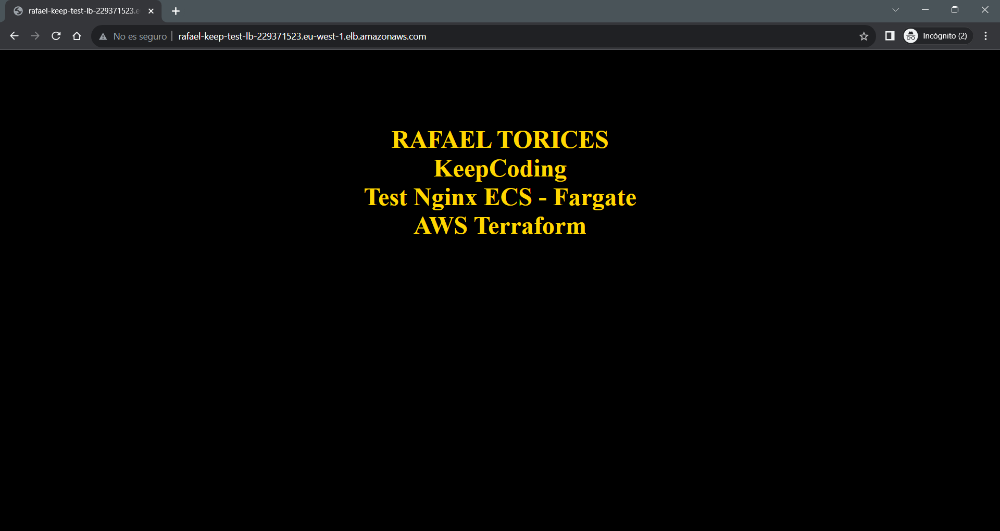

# AWS-RafaelTorices

Repositorio de la práctica del módulo AWS de KeepCoding.

## Descripción

Despliegue de un servidor web `Nginx` en un cluster `ECS de AWS` mediante `Terraform` usando `tasks de Fargate`. Se obtiene un endpoint con la url de acceso web al servicio de Nginx desplegado mediante las tasks.

El proyecto se compone de los siguientes recursos organizados por módulos:

- **Networks - VPC**: Creación de una VPC y sus Subnets en las distintas zonas de disponibilidad donde se desplegarán los recursos, una internet gateway y una tabla de routes.
- **Security Groups - SG**: Creación de un Security Group para el cluster de ECS.
- **Load Balancer - ALB**: Creación de un Load Balancer para el cluster de ECS con un Listener y un Target Group.
- **Cluster Containers - ECS**: Creación del cluster de ECS con el servicio y las Tasks Fargate.
- **Elastic File System - EFS**: Creación de un sistema de ficheros EFS para disponer de un volumen persistente en las Tasks de Fargate.

## Requisitos

Para poder desplegar la infraestructura necesitaremos tener instalado en nuestra máquina local: **el client shell de AWS**, **el client shell de Terraform** y **_disponer de una cuenta de AWS_** con los permisos necesarios para crear y desplegar recursos en el cloud de AWS.
Debemos configurar el client shell de AWS con las credenciales de nuestra cuenta de AWS, para ello, ejecutaremos el siguiente comando en la consola de comandos: `aws configure` y nos pedirá las credenciales de nuestra cuenta de AWS. Una vez configurado el client shell de AWS, podremos ejecutar comandos para interactuar con los recursos de AWS. Para instalar el client shell de AWS, podemos seguir la documentación oficial de AWS: https://aws.amazon.com/es/cli/. Para instalar el client shell de Terraform, podemos seguir la documentación oficial de Terraform: https://learn.hashicorp.com/tutorials/terraform/install-cli. Para crear una cuenta de AWS, podemos seguir la documentación oficial de AWS: https://aws.amazon.com/es/premiumsupport/knowledge-center/create-and-activate-aws-account/.

## Estructura

El proyecto está estructurado en módulos diferenciados para cada recurso de la infraestructura y en la raíz del proyecto, se encuentra la carpeta `root` con los ficheros para el despliegue de la infraestructura.

Este es el árbol de directorios del proyecto:

- **Readme.md**: Fichero con la documentación del proyecto.
- **demo/**: Carpeta con imágenes demo del proyecto en el Readme.
- **modules/**: Carpeta con los distintos módulos del proyecto.
  - **modules/alb/**: Módulo con la configuración del Load Balancer.
  - **modules/ecs/**: Módulo con la configuración del cluster de ECS.
  - **modules/efs/**: Módulo con la configuración del sistema de ficheros EFS.
  - **modules/sg/**: Módulo con la configuración del Security Group.
  - **modules/vpc/**: Módulo con la configuración de la VPC.
- **root/**: Carpeta con los ficheros para el despliegue de la infraestructura.
  - **root/main.tf**: Fichero principal de despliegue de la infraestructura.
  - **root/terraform.tfvars**: Fichero con las variables personalizadas para el despliegue de la infraestructura en AWS.
  - **root/variables.tf**: Fichero con las variables de configuración de la infraestructura.
  - **root/outputs.tf**: Fichero con los outputs del despliegue.
  - **root/providers.tf**: Fichero con la configuración de los proveedores de la infraestructura.

## Despliegue

> ATENCIÓN: Antes de proceder a desplegar la infraestructura, debemos configurar el fichero `/root/terraform.tfvars` con los valores de las variables personalizadas para el despliegue de la infraestructura en AWS, en este caso, el nombre del proyecto para identificarlo en nuestro cloud AWS.

Para desplegar la infraestructura, ejecutaremos el siguiente comando **dentro de la carpeta /root** del proyecto:

`terraform init`

`terraform apply`

(**_También podemos usar: `terraform apply --auto-approve`_** para lanzar el despliegue sin tener que confirmar la creación de los recursos).

## Acceso

Una vez desplegada la infraestructura, podemos acceder al servidor web Nginx desplegado en el cluster de ECS mediante el **endpoint** generado del Load Balancer que se mostrará en la shell al finalizar el despliegue. Para acceder al servidor web, copiaremos el endpoint obtenido y lo probaremos en un navegador web. Se mostrará un index.html personalizado.

## Demo

## Destrucción

Para destruir la infraestructura, ejecutaremos el siguiente comando dentro de la carpeta `/root` del proyecto:

`terraform destroy --auto-approve`

## Autor

**_Rafael Torices_**

## Referencias

Terraform: https://www.terraform.io/docs/providers/aws/index.html

AWS: https://aws.amazon.com/es/

AWS Client shell: https://aws.amazon.com/es/cli/
